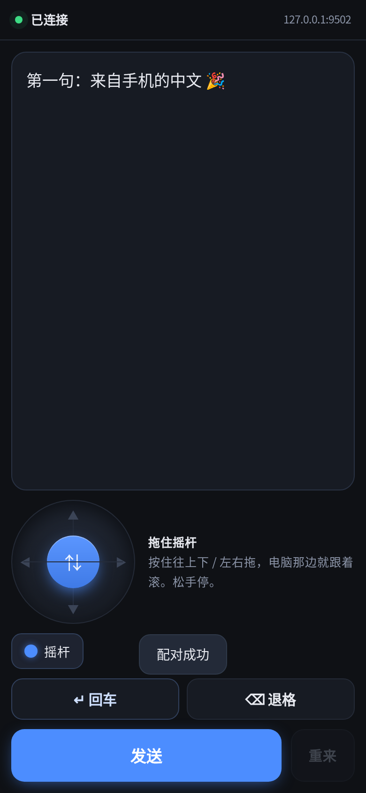
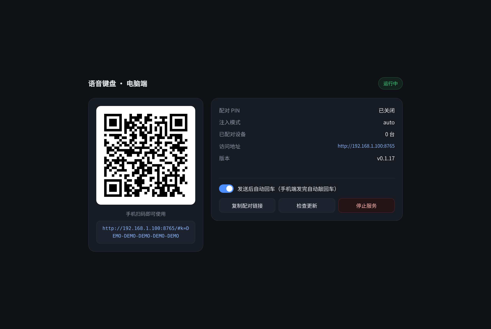

# 语音键盘

[](https://github.com/talongao/voice-keyboard/actions/workflows/build.yml)
[](LICENSE)
[](#平台支持)
[](https://linux.do/)

**把手机当成电脑的远程键盘**：手机上打出来 / 说出来的文字，直接插进电脑当前光标位置。

<p align="center">
  
  &nbsp;&nbsp;
  
</p>

## 为什么做这个

对着电脑说话需要出声，在办公室里并不方便；而手机就在手边，**离嘴只有 20 厘米**，
用输入法自带的语音输入可以很小声地说。

而且手机上有屏幕：**识别错了能看见、能修改、改完再发送**。这一点是硬件语音键盘
（例如 Ulanzi 一类）做不到的 —— 它们只能盲发。

换句话说：**不必为此再添置一个外设 —— 手机本身就是随身携带的最好的语音输入设备。**

## 特性

- **手机端即一个网页** —— 无需安装 App、无需上架与签名，iOS / Android / 鸿蒙通用
- **复用手机输入法的语音输入** —— 免费、可离线，中文识别质量优于自行接入 ASR
- **可见可改再发送** —— 识别有误当场修正，无需反复删除重来
- **在光标处插入文字** —— 记事本 / VS Code / 浏览器 / 聊天输入框行为一致
- **滚轮摇杆** —— 按住拖动即可滚动电脑端页面，浏览长文档无需触碰鼠标
- **独立的「回车」「退格」按键** —— 发送消息与修正错字均无需触碰电脑
- **托盘图标**（Windows 任务栏 / macOS 菜单栏）与**浏览器控制台页**
- **三平台注入**：Windows `SendInput`、macOS `CGEvent`、Linux `XTEST`
- **单文件可执行** —— 无需 Python / Rust 或任何运行时；手机端零安装

## 下载

从 [**Releases**](https://github.com/talongao/voice-keyboard/releases/latest) 页面下载最新版本：

| 平台 | 文件 | 说明 |
|---|---|---|
| **Windows** | `voice-keyboard.exe` | 双击运行；首次启动时请在防火墙提示中选择「允许访问」 |
| **macOS** | `voice-keyboard-macos-app.zip` | 解压后把 `语音键盘.app` 拖进「应用程序」，双击。**M 系列 + Intel 通用** |
| macOS（命令行） | `voice-keyboard-macos.tar.gz` | 裸二进制，在终端中运行。**无菜单栏图标**（macOS 的图标必须位于 `.app` 内），可用 `--console` 打开控制台页 |
| **Linux** | `voice-keyboard` | `chmod +x voice-keyboard && ./voice-keyboard`（X11；Wayland 注入无效） |

> macOS 首次运行可能被 Gatekeeper 拦截：右键 →「打开」即可（CI 中已做 ad-hoc 签名）。
> 然后**必须去「系统设置 → 隐私与安全性 → 辅助功能」把「语音键盘」勾上**——
> 不勾的话：菜单栏图标不出现（而且不报错），注入也会被静默挡掉。

## 快速上手

1. **在电脑上启动**：双击 `voice-keyboard.exe`、双击 `语音键盘.app`，或在终端运行二进制。
   托盘出现图标，浏览器自动打开控制台页。
2. **手机连同一个 WiFi**，扫控制台页上的二维码（或手输地址 + 6 位 PIN）。
3. **手机上打字或语音 → 点「发送」**，文字就出现在电脑光标处。

## 手机端

| 元素 | 干什么 |
|---|---|
| 大输入框 | 输入文字，或使用输入法的 **🎤 语音输入** |
| **滚轮摇杆** | 按住向上下 / 左右拖动 → 电脑端跟随滚动，松手即停；左侧「摇杆」按钮可收起 |
| **「↵ 回车」** | 让电脑敲一次回车（发送消息、提交表单） |
| **「⌫ 退格」** | 删一个字，**长按连删** |
| 「发送」 | 将输入框内容插入电脑光标处。**发送后是否回车由电脑端决定** |
| 「重来」 | 60 秒内可撤销刚才插入的内容，并放回输入框以便修改 |

> 为什么回车开关放在电脑端：写代码时不要回车、聊天时要，这是**电脑上的场景**决定的。
> 两端各放一个开关会变成 AND 关系，电脑端一关手机端那个就白点了。

## 电脑端

启动后包含两部分：

- **托盘图标**：左键或菜单 → 打开控制台 / 复制配对链接 / 停止服务并退出
- **控制台页**（`http://127.0.0.1:8765/console`，只允许本机访问）：
  二维码、地址、PIN、回车开关、停止服务按钮

**关闭浏览器标签页不影响服务**（它只是一个页面）。需要再次打开控制台时：点击托盘图标、
执行 `voice-keyboard --console`，或**再次双击程序**（程序会识别到已有实例并请其打开页面）。

## 命令行

```
--port <n>       监听端口（默认 8765；被占用时自动往后找空端口）
--host <addr>    监听地址（默认 0.0.0.0）
--mode <m>       auto | dryrun（dryrun 只打印不注入，调试用）
--headless       只跑服务：不开托盘、不开浏览器
--no-tray        不要托盘图标
--no-browser     启动时不要自动打开控制台页面
--strict-port    端口被占用就报错退出，不要换端口
--status         打印当前实例的端口 / 地址 / 配对链接（不起服务）
--console        在浏览器里打开当前实例的控制台页面
--stop           停掉正在跑的实例
--no-auth        关闭 PIN 校验（仅限完全可信的网络）
--no-enter       禁用「发送后回车」功能
--quiet          不打印横幅
-h, --help       帮助
```

> Windows 的 release 版是**无控制台程序**（双击不弹黑框）。想看命令行输出就从
> cmd / PowerShell 启动（程序会把输出挂回那个终端）；双击启动没有输出是正常的，
> 一切都在 exe 旁边的 `voice-keyboard.log` 里。

## 平台支持

| | Windows | macOS | Linux / X11 | Linux / Wayland |
|---|---|---|---|---|
| 注入文字 | ✅ SendInput | ✅ CGEvent（要授权辅助功能） | ✅ XTEST | ❌ 系统层面不给权限 |
| 滚轮 | ✅ | ✅ | ✅（横向滚动部分程序不认） | ❌ |
| 托盘图标 | ✅ 任务栏右下 | ✅ 菜单栏（不进 Dock） | ⛔ 没做（要引 GTK） | ⛔ |
| 控制台页 | ✅ | ✅ | ✅ | ✅ |

## 常见问题

**手机连不上？**
- 首次启动时 Windows 防火墙需选择「允许访问」
- 确认手机和电脑在同一个 WiFi；办公 WiFi 如果开了 AP 隔离（同一个网但设备互相看不见），
  用 [Tailscale](https://tailscale.com/) 组个虚拟局域网，本程序不用改任何配置
- 手机页顶栏会显示当前连接的地址；若仍连不上，重新扫描一次二维码

**文字没有出现在预期位置？**
- 注入目标是**发送那一刻的前台窗口**。若在手机打字期间切换了电脑窗口，文字会进入新的前台窗口 ——
  这是此类工具的固有特性，并非缺陷
- 目标程序若**以管理员身份运行**，普通权限的注入会被 Windows UIPI 拦截

**macOS 上菜单栏没有图标？**
- 绝大多数情况是未授权：**系统设置 → 隐私与安全性 → 辅助功能 → 勾选「语音键盘」**。
  未授权时图标不出现，也不会报错
- 另外**裸二进制（tar.gz）不含托盘图标**，需使用 `.app`

**端口被占用？**
- 程序会自动向后查找空端口（8766、8767…），控制台页与日志中会写明实际使用的端口
- `voice-keyboard --status` 可随时查询当前端口；`--strict-port` 可要求端口被占用时直接报错

**文字偶尔丢失一两个字？（仅 Linux）**
- X11 没有"直接输入任意 Unicode 字符"的接口，注入需"临时修改键码 → 按键"，
  系统繁忙时可能丢失字符。实测 Rust 版 8 轮中 1 轮丢失 2 个字符。
  **Windows / macOS 不使用该路径，不受影响。**
- 三平台注入统一通过 [enigo](https://github.com/enigo-rs/enigo) 实现，无需安装外部命令

**排查问题看哪里？**
- 程序同目录下的 `voice-keyboard.log`（目录不可写时退到临时目录），启动横幅中会打印具体路径。
  其中记录参数、实际端口、监听结果、托盘状态、托盘点击，以及崩溃时的 panic 信息
  （Windows 上还会弹出对话框）
- 日志中包含配对密钥与 PIN，对外提供日志前请先删除相关行

## 工作原理

```
手机浏览器                                电脑（一个进程）
┌──────────────────┐                    ┌──────────────────────────────┐
│ 输入框 + 🎤        │ ── HTTP(局域网) ──→ │ HTTP 服务（配对 / 注入 / API）  │
│ 摇杆 ⇅ / 回车 ⌫    │                    │  ├─ enigo → 当前光标          │
│ [发送] [重来]      │ ←── 状态/响应 ────  │  ├─ 托盘图标（Win / macOS）    │
└──────────────────┘                    │  └─ 控制台页（本机浏览器打开）   │
                                         └──────────────────────────────┘
```

- **没有原生窗口**：电脑端界面即浏览器中的控制台页。这样也避免了整类"窗口生命周期"问题
  （窗口隐藏后无法唤起、事件循环不响应、关闭窗口导致服务退出等）
- 手机端页面与电脑端控制台页均为单文件 HTML，由服务端内联提供
- 配对：二维码承载 32 字节随机密钥（经 URL hash 传递，不发送给服务端）；6 位 PIN 为手输兜底
- 每台设备一个令牌，服务重启后全部失效

## HTTP API

如需自行实现客户端（例如原生 App），可使用以下接口：

| 方法 | 路径 | 说明 |
|---|---|---|
| GET | `/` | 手机页面 |
| GET | `/console` | 控制台页（仅本机） |
| GET | `/api/info` | `{need_auth, mode, allow_enter}` |
| POST | `/api/pair` | `{pin}` 或 `{k}` → `{token}` |
| GET | `/api/endpoints` | 候选地址列表（本机网卡地址） |
| POST | `/api/send` | `{text, enter}` → 注入文字 |
| POST | `/api/undo` | `{chars, enter}` → 退格撤销刚插入的内容 |
| POST | `/api/key` | `{key}` → 单个按键（enter / backspace / tab / esc / 方向键） |
| POST | `/api/scroll` | `{dx, dy}` → 滚轮，单位为「格」（dy 为正向下、dx 为正向右） |
| GET | `/api/status` | 运行状态（仅本机） |
| POST | `/api/show` | 打开控制台页（仅本机） |
| POST | `/api/settings` | `{allow_enter}` → 改开关（仅本机） |
| POST | `/api/shutdown` | 停服务（仅本机） |

除 `/`、`/console`、`/api/info`、`/api/pair` 外，其余都要带 `Authorization: Bearer <token>`。

## 从源码构建

需要 Rust（[rustup.rs](https://rustup.rs/)）；macOS 上还要 `xcode-select --install`。

```bash
git clone https://github.com/talongao/voice-keyboard.git
cd voice-keyboard
cargo build --release --manifest-path rust/Cargo.toml
./rust/target/release/voice-keyboard
```

交叉编译 Windows（在 Linux 上用 mingw）：

```bash
rustup target add x86_64-pc-windows-gnu
cargo build --release --manifest-path rust/Cargo.toml --target x86_64-pc-windows-gnu
```

macOS 的通用二进制（M 系列 + Intel）只能在 macOS 上打：

```bash
cargo build --release --manifest-path rust/Cargo.toml --target aarch64-apple-darwin
cargo build --release --manifest-path rust/Cargo.toml --target x86_64-apple-darwin
lipo -create -output voice-keyboard \
  rust/target/aarch64-apple-darwin/release/voice-keyboard \
  rust/target/x86_64-apple-darwin/release/voice-keyboard
```

推送到仓库的代码由 [GitHub Actions](.github/workflows/build.yml) 自动在三平台构建并运行测试；
推送 `v0.1.x` 形式的标签会自动创建 Release。

## 参与贡献

欢迎提交 Issue 与 Pull Request。

- 功能开发与缺陷修复均在 `develop` 分支进行；`master` 仅通过 Pull Request 合入，
  且 `windows` / `macos` / `linux` / `test` 四项 CI 检查必须全部通过
- 提交前请在本地跑通测试（见下）；涉及界面改动的请附截图
- 分支策略、发版流程与已知问题见 [**AGENTS.md**](AGENTS.md)

### 本地测试

```bash
# 接口层：HTTP → 鉴权 → 注入 → 应用实际收到的文本（需要 X11 环境）
sudo apt install xvfb xdotool xterm
./tests/e2e_xvfb.sh

# 手机端：真实浏览器操作页面（可选）
npm i playwright && npx playwright install chromium
VK_PW=/path/to/node_modules/playwright ./tests/browser/run.sh
```

### 代码结构

| 路径 | 说明 |
|---|---|
| `rust/src/main.rs` | 入口：命令行参数、托盘生命周期、主线程消息循环 |
| `rust/src/http.rs` | HTTP 服务与全部 API 端点 |
| `rust/src/inject.rs` | 三平台文字与按键注入 |
| `rust/src/state.rs` | 运行时状态、配对与令牌管理 |
| `rust/src/tray.rs` | 托盘图标与菜单 |
| `index.html` / `console.html` | 手机端页面 / 电脑端控制台页（编译期内联进二进制） |

## 隐私与安全

- **不采集、不上传任何数据**：程序不发起任何出站连接，仅在局域网监听一个端口。
  （控制台页的「检查更新」是**浏览器**去问 GitHub API，且只有你点那一下才查，程序本身不联网）
- **不保存输入内容**：内存与 API 中只保留「时间 / 字数 / 是否回车」，日志文件不含正文
- 配对密钥为 32 字节随机值，经 URL hash 传递，不发送给服务端；6 位 PIN 为手输兜底
- 每台设备一个令牌，服务重启后全部失效
- 程序需要注入权限（Windows 无需额外授权、macOS 需辅助功能权限、Linux 依赖 X11）
- 建议仅在可信局域网内使用，不要将服务端口暴露到公网

## 社区

感谢 [LINUX DO](https://linux.do/) 社区。

## 许可证

本项目以 [MIT 许可证](LICENSE) 发布：可自由使用、修改与分发，包括商业用途和闭源衍生，
条件是保留原始版权声明与许可声明。

第三方依赖均为宽松许可证（MIT / Apache-2.0 / BSD / Zlib / ISC），不含 GPL / AGPL 等传染性条款。

